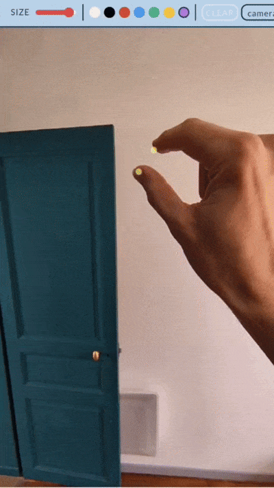

# AR-Painter
## Description
This project was made in the context of the course : *Réalité Virtuelle et Augmentée*, given by Isaac Pante at the University of Lausanne. 
It was made with the intention to try *Mediapipe's* hand-tracking integration for Javascript. The WebApp allows it's users to paint in the air with one of their hands, by pinching their index and thumb together.

## Usage
The site is deployed [here](https://squidez.github.io/AR-Painter/).
Otherwise everything is contained in the `index.html`, so you can just download it and execute it.

The site should work on any computer or phone with a camera. Show one of your hand and start painting by pinching your index and thumb together. You have several options on the screen. A slider to change the "brush" size. You can select between seven defined colors. The painting can be completely ereased by clicking the **CLEAR** button. Finally, you can select any camera of the device (to access the rear or front camera of your phone).

**Note** : You may have to use the site in *computer version* to have the full header.

## Dependencies
- [MediaPipe](https://ai.google.dev/edge/mediapipe/solutions/vision/hand_landmarker/web_js), for the hand-tracking.
- [eruda](https://github.com/liriliri/eruda), for mobile debugging.

## Improvements & Issues
- The camera selection  is a little bit bugged, you sometimes need to switch several times before the new camera is active.
- The viewport is not scallable to prevent phone cameras to zoom in. Wich can result in a cropped GUI for some mobiles. For now you need to load the site in *computer version* to prevent this.
- The colors are fixed for now, adding a custom color option would be nice.
- An eraser option, rather that clearing all the canvas, would also be nice.
- An option to save the image could be added.

## Ressources
- [collidingScopes's](https://github.com/collidingScopes/threejs-handtracking-101/tree/main) tutorial on MediaPipe are really handy to get the hang of it.
